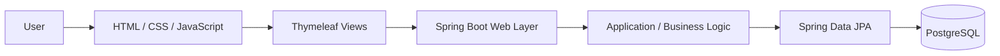

# SMARTS: Subcontracting Management and Resource Tracking System

> SMARTS is a web-based resource and subcontracting management platform developed to replace manual tracking of projects, inventory, materials, and client-related operations with a centralized digital workflow. The application is built with Java, Spring Boot, Thymeleaf, HTML/CSS/JavaScript, and PostgreSQL.

## Project Overview

### What It Is

SMARTS (Subcontracting Management and Resource Tracking System) was developed for a construction subcontracting use case where operational information was previously handled through manual and fragmented processes.

The system centralizes project, inventory, material, client, and financial information so authorized users can monitor resources, process material requests, manage project activity, generate invoices, and review operational reports from one application.

This was developed as a team software engineering project. My primary responsibilities were **Business Analysis and Front-End Development**, with particular ownership of translating stakeholder requirements into system behavior and validating that the implemented interfaces matched those requirements.

### Key Features

- **Project Management** — Centralized monitoring of ongoing and completed projects, including project information, status, and resource activity.
- **Inventory and Material Tracking** — Tracks material inflows, outflows, availability, and low-stock conditions.
- **Material Request Workflow** — Supports structured requests for project materials and their corresponding approval workflow.
- **Invoice Generation** — Supports invoice creation based on project and material-related information.
- **Reporting and Analytics** — Provides operational and financial visibility into metrics such as project costs, revenue, expenses, and net profit.
- **User and Access Management** — Supports differentiated system access for administrative and operational users.

---

## My Role & Core Contributions

**Role:** Business Analyst and Front-End Developer

### Personal Scope & Ownership

My responsibilities focused on bridging **business requirements, system behavior, user experience, and software validation**.

- **Analyzed stakeholder and operational requirements** to understand existing manual workflows, identify system pain points, and define expected application behavior.

- **Translated business needs into technical and functional specifications** that provided the development team with clearer implementation requirements.

- **Mapped end-to-end business processes** using process flow diagrams, establishing a functional roadmap for how users, data, and system actions should interact.

- **Supported requirements traceability** by using documented workflows as a reference for implementation review, test-scenario development, and test-data preparation.

- **Developed and refined front-end interfaces** used to interact with core SMARTS workflows, translating functional requirements into usable application screens.

- **Validated front-end behavior against documented requirements**, checking functionality, usability, workflow consistency, and expected results before deployment.

- **Collaborated with the development team throughout implementation and testing**, helping resolve differences between intended business behavior and the implemented application.

### Engineering Highlights & Problem Solving

#### 1. Converted Manual Operations into Defined System Workflows

Analyzed manual processes involving **inventory, materials, projects, and clients** and converted them into structured workflows that could be implemented consistently within the application.

This required identifying:

- user actions and decision points;
- required information at each step;
- expected system responses;
- dependencies between workflows; and
- conditions that needed to be validated during testing.

#### 2. Created a Requirements-to-Testing Bridge

Process flows were designed not only as documentation but also as a practical reference for implementation and quality assurance.

The documented system behavior helped establish a traceable path between:

```text
Stakeholder Need
      |
      v
Business Requirement
      |
      v
Process Flow / Expected Behavior
      |
      v
Application Interface
      |
      v
Test Scenario and Test Data
      |
      v
Validated System Behavior
```

This approach reduced ambiguity between business expectations and implementation.

#### 3. Validated Front-End Behavior from a Business and User Perspective

Combined front-end development with requirements-based testing rather than treating the interface as a purely visual layer.

Interfaces were reviewed against expected workflows to verify that:

- required information was available to users;
- actions followed the intended business sequence;
- inputs and outputs aligned with documented requirements; and
- implemented screens supported the actual operational process.

This experience strengthened my ability to work across **requirements analysis, software development, UI implementation, and quality assurance**.

---

## Architecture & Tech Stack

SMARTS follows a server-rendered Spring Boot web application architecture.

### Languages & Frameworks

**Backend**

- Java 17
- Spring Boot 3.4.1
- Spring Web
- Spring Data JPA
- Jakarta Bean Validation
- Lombok

**Frontend**

- Thymeleaf
- HTML
- CSS
- JavaScript

**Database**

- PostgreSQL
- Hibernate / JPA

**Application Monitoring**

- Spring Boot Actuator

### Development & Build Tools

- Maven
- Maven Wrapper
- Git
- GitHub
- Spring Boot Test
- Notion
- Google Drive

### High-Level Architecture



At a high level:

1. Users interact with server-rendered web interfaces built using Thymeleaf, HTML, CSS, and JavaScript.
2. Spring Boot handles application requests and workflow processing.
3. Application logic coordinates project, inventory, material, invoice, reporting, and user-related operations.
4. Spring Data JPA provides persistence between the Java application and PostgreSQL.
5. PostgreSQL maintains the system's operational data.

---

## Impact & Key Takeaways

### Project Impact

SMARTS addressed a real operational problem: important subcontracting information was being tracked through manual and fragmented processes.

The resulting system consolidated at least **four major operational areas** into a centralized application:

1. Inventory
2. Materials
3. Projects
4. Client-related operations

It also connected these records with supporting workflows for material requests, invoicing, reporting, and user management.

No production benchmark or percentage-efficiency improvement is claimed here because quantitative before-and-after measurements were not formally captured. The primary demonstrated impact is the transformation of manual workflows into a structured, traceable digital system.

### Key Technical Takeaways

This project strengthened my experience in:

- translating ambiguous stakeholder needs into implementable software requirements;
- converting real business processes into structured system workflows;
- building front-end interfaces around actual operational requirements;
- maintaining traceability between requirements, implementation, and testing;
- validating software from both technical and end-user perspectives;
- working with a Java/Spring Boot/PostgreSQL application stack; and
- collaborating across business analysis, development, and quality-assurance activities.

It also reinforced an important software engineering principle:

> A technically correct application is only successful when its implementation accurately represents the workflow and problem it was designed to solve.

---

## Responsible Use

SMARTS was developed for a specific client use case and reflects the operational requirements, workflows, and business processes identified for that organization.

This repository is made available for portfolio, academic, and technical documentation purposes only. It is intended to demonstrate the system design, development approach, technical implementation, and individual project contributions.

The repository should not be treated as a production-ready system for unrelated organizations without further requirements analysis, security review, testing, configuration, and adaptation to the intended deployment environment.

Any client-specific, confidential, sensitive, or production data should not be stored or published in this repository.

---

## Project Context

**Project Type:** Team Software Engineering Project  
**Domain:** Construction / Subcontracting Resource Management  
**Primary Personal Role:** Business Analyst and Front-End Developer  

---

## Repository Note

This repository represents a collaborative software engineering project. Features outside the **My Role & Core Contributions** section should be understood as capabilities of the overall team-developed system and are not presented as individual contributions.
